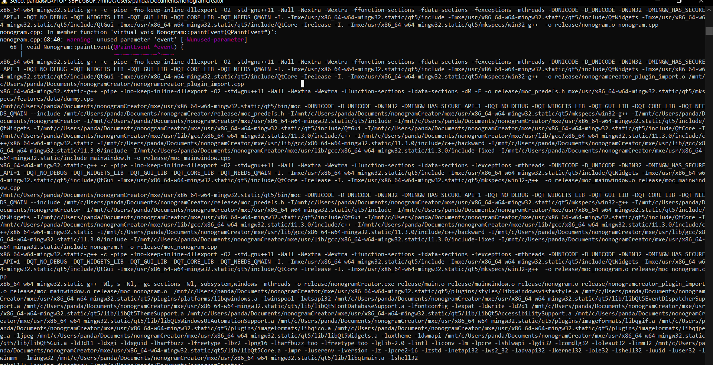

# Cross compilation
## content table
- [Cross compilation](#cross-compilation)
  - [content table](#content-table)
  - [Project](#project)
  - [Qt and mxe](#qt-and-mxe)
    - [WSL](#wsl)
      - [step 1](#step-1)
      - [step 2](#step-2)
      - [step 3](#step-3)
      - [step 4](#step-4)
    - [Compiling](#compiling)
      - [step 1](#step-1-1)
      - [step 2](#step-2-1)
      - [step 3](#step-3-1)
      - [step 4](#step-4-1)
      - [step 5](#step-5)
      - [step 6](#step-6)
      - [step 7](#step-7)
      - [step 8](#step-8)

## Project

this application is a nonogram creator, a nonogram is a grid surrounded by numbers on the top and left side. these numbers correspond to a group of filled squares in that row /column


I've been wanting to create a solver for nonograms but needed examples and such, create the creator will help me create and test the solver.

## Qt and mxe 

### WSL
First we need a linux environment to do the cross compilation on. I chose for a ubuntu 22.04 WSL enviroment meaning it is integrated with windows. making it easier to access files. it is also a good way of doing it step by step keeping the progress not having to do it over and over.

#### step 1
search for "Turn Windows Features on or off" and open that.

#### step 2
Look for "Windows Subsystem for Linux" select it and click ok.

#### step 3
Next we look for [Ubuntu 22.04.1 LTS](https://www.microsoft.com/store/productId/9PN20MSR04DW) on the microsoft store. and install it

#### step 4
Restart the computer and open WSL or the Ubuntu 22.04.1 LTS app we just downloaded.

### Compiling
We use the [mxe tutorial](https://mxe.cc/#tutorial) to build the cross compiler and compile with it.

#### step 1
first run `apt-get -y update` and `apt-get upgrade` so everything installed is up to date.

On the [mxe website](https://mxe.cc/#requirements-debian) we get the requirements for debian/ derivatives . It tells us what it needs to function so we install this. we run: 
```
apt-get install \
    autoconf \
    automake \
    autopoint \
    bash \
    bison \
    bzip2 \
    flex \
    g++ \
    g++-multilib \
    gettext \
    git \
    gperf \
    intltool \
    libc6-dev-i386 \
    libgdk-pixbuf2.0-dev \
    libltdl-dev \
    libssl-dev \
    libtool-bin \
    libxml-parser-perl \
    lzip \
    make \
    openssl \
    p7zip-full \
    patch \
    perl \
    python3 \
    python3-mako \
    ruby \
    sed \
    unzip \
    wget \
    xz-utils
```

#### step 2
We choose a file location to clone the mxe repository. we need this to build and compile our cross compiler.
we use `git clone https://github.com/mxe/mxe.git` to clone.

#### step 3
building the qt base requires python, this uses the python keyword so we have to create a symbolic link `ln -s /usr/bin/python3 /usr/bin/python`

Before we can compile the project we have to build the compiler so we download the qtbase package. we go inside the mxe directory (repository) and run the command `make download-qtbase` 

#### step 4

then when the package is downloaded, we build the package with `sudo make qbase MXE_TARGETS='x86_64-w64-mingw32.static'`
the target is windows 64 bit where it is statically linked meaning it becomes one big executable.

#### step 5
We need to add the cloned repositories environment variables to the global environment variables `($PATH)`. this contains settings and such so the compilation can happen. We run export `PATH=/where MXE is installed/usr/bin:$PATH` to make this happen, this has to be a full path.

#### step 6
Now we will run qmake this will help generate make files. So that we will be able to compile it. Go into the folder with the project files. Then run qmake by going to this path `/where MXE is installed/usr/x86_64-w64-mingw32.static/qt5/bin/qmake`.

#### step 7
Now we have to run make to actually compile everything. so run `make` in the project directory. This should start compiling and when it's done it should look something like this.



#### step 8
go to the project folder open the release folder and there should be a nonogram.exe. this is the application

